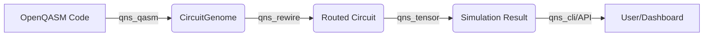

# QNS (Quantum Noise Symbiote) 통합 명세서

**문서 버전:** 1.0.0
**작성일:** 2025-12-01
**작성자:** Antigravity (Google Deepmind Agentic AI)
**프로젝트:** Synomia Civilization - Quantum Computing Engine

---

## 1. 개요 (Overview)

### 1.1. 프로젝트 정의

**QNS (Quantum Noise Symbiote)**는 양자 컴퓨팅의 핵심 과제인 **노이즈(Noise)**와 **연결성(Connectivity)** 문제를 해결하고, 대규모 양자 회로의 효율적인 시뮬레이션을 제공하기 위해 설계된 차세대 양자 컴퓨팅 플랫폼입니다. Rust 언어의 고성능과 안전성을 기반으로 하며, **PPR (Purposeful-Programming Revolution)** 및 **Gantree** 방법론을 적용하여 설계되었습니다.

### 1.2. 개발 목적

1. **현실적 제약 해결**: 이상적인 큐비트가 아닌, 제한된 연결성을 가진 실제 하드웨어(NISQ) 환경에서의 실행 가능성 확보.
2. **확장성 확보**: 상태 벡터(State Vector) 방식의 메모리 한계를 극복하기 위해 텐서 네트워크(Tensor Network) 기술 도입.
3. **접근성 강화**: 표준 OpenQASM 3.0 지원 및 웹 기반 대시보드를 통한 사용자 친화적 환경 제공.
4. **AI 협업 최적화**: 다른 AI 에이전트들이 분석하고 최적화할 수 있는 명확한 구조와 인터페이스 제공.

---

## 2. 시스템 아키텍처 (System Architecture)

QNS는 모듈화된 크레이트(Crate) 구조로 구성되어 있으며, 각 모듈은 독립적이면서도 유기적으로 연결됩니다.

### 2.1. 모듈 구성

| 모듈명 | 역할 | 주요 기술 |
| :--- | :--- | :--- |
| **`qns_core`** | 핵심 자료구조 정의 (Circuit, Gate, Qubit) | Rust Structs/Enums |
| **`qns_qasm`** | OpenQASM 소스 코드 파싱 및 IR 변환 | `nom` Parser Combinator |
| **`qns_rewire`** | 하드웨어 토폴로지 매핑 및 라우팅 (SWAP 최적화) | BFS, Lookahead Heuristic |
| **`qns_tensor`** | 텐서 네트워크 기반 양자 상태 시뮬레이션 | MPS, SVD (`nalgebra`), `ndarray` |
| **`qns_cli`** | CLI 도구 및 REST API 서버 | `clap`, `axum`, `tokio` |
| **`web`** | 웹 대시보드 (Frontend) | Next.js, Vanilla JS/CSS |

### 2.2. 데이터 파이프라인



---

## 3. 핵심 기능 및 알고리즘 (Core Features & Algorithms)

### 3.1. OpenQASM 파서 (`qns_qasm`)

- **기능**: 텍스트 형태의 양자 회로 코드를 내부 AST(Abstract Syntax Tree)로 변환하고, 이를 실행 가능한 `CircuitGenome` 객체로 빌드합니다.
- **특징**: `nom` 라이브러리를 사용하여 제로 카피(Zero-copy)에 가까운 고성능 파싱을 수행합니다.

### 3.2. 고급 라우팅 엔진 (`qns_rewire`)

- **문제 정의**: 큐비트 $q_i$와 $q_j$ 사이에 게이트를 적용하려면, 두 큐비트가 하드웨어적으로 인접해야 합니다. 인접하지 않은 경우 SWAP 게이트를 통해 위치를 이동시켜야 합니다.
- **알고리즘**: **Lookahead Heuristic**
  - **목표**: 전체 회로의 SWAP 게이트 수 최소화.
  - **원리**: 현재 게이트뿐만 아니라, 미래의 $N$개 게이트(Window Size)까지 고려하여 최적의 SWAP 경로를 선택합니다.
  - **비용 함수 (Cost Function)**:
      $$ Cost(M) = \sum_{g \in Window} \text{distance}_M(control_g, target_g) \times \text{weight}_g $$
      여기서 $M$은 큐비트 매핑, $\text{distance}_M$은 매핑 $M$에서의 최단 경로 거리(BFS)입니다.

### 3.3. 텐서 네트워크 시뮬레이터 (`qns_tensor`)

- **기술**: **MPS (Matrix Product State)**
  - 양자 상태 $|\psi\rangle$를 텐서들의 곱으로 표현하여 메모리 사용량을 지수적($2^N$)에서 다항식($N \times \chi^2$) 수준으로 감소시킵니다.
- **핵심 알고리즘**: **SVD (Singular Value Decomposition) 및 Truncation**
  - 2-Qubit 게이트 적용 후 얽힘(Entanglement)으로 인해 텐서 차원(Bond Dimension)이 증가합니다.
  - 이를 SVD로 분해하고, 작은 특이값(Singular Value)을 버려(Truncation) 근사함으로써 효율성을 유지합니다.
  - **수식**:
      $$ \Theta_{ij} \xrightarrow{SVD} U \Sigma V^\dagger \approx U' \Sigma' V'^\dagger $$
      여기서 $\Sigma'$는 상위 $\chi$개의 특이값만 남긴 대각 행렬입니다.

---

## 4. 수학적 배경 (Mathematical Foundation)

### 4.1. 양자 상태와 텐서

- **상태 벡터**: $|\psi\rangle = \sum_{i=0}^{2^N-1} c_i |i\rangle$ (차원: $2^N$)
- **MPS 표현**:
  $$ c_{i_1 i_2 \dots i_N} = \sum_{\alpha_1, \dots, \alpha_{N-1}} A^{(1)}_{i_1 \alpha_1} A^{(2)}_{\alpha_1 i_2 \alpha_2} \dots A^{(N)}_{\alpha_{N-1} i_N} $$
  각 $A^{(k)}$는 3차원 텐서 (Physical index $i_k$, Bond indices $\alpha_{k-1}, \alpha_k$)입니다.

### 4.2. 슈미트 분해 (Schmidt Decomposition)

- 임의의 이분계(Bipartite) 상태 $|\psi\rangle_{AB}$는 다음과 같이 표현 가능합니다:
  $$ |\psi\rangle_{AB} = \sum_{i} \lambda_i |u_i\rangle_A \otimes |v_i\rangle_B $$
  여기서 $\lambda_i$는 슈미트 계수(특이값)이며, 얽힘 엔트로피(Entanglement Entropy) $S = -\sum \lambda_i^2 \log(\lambda_i^2)$와 관련됩니다. QNS는 이 $\lambda_i$를 기준으로 정보를 압축합니다.

---

## 5. 예시 코드 (Example Code)

### 5.1. Rust: 텐서 네트워크 시뮬레이션

```rust
use qns_tensor::TensorNetwork;
use qns_core::Gate;

fn main() -> Result<(), Box<dyn std::error::Error>> {
    // 2-Qubit 텐서 네트워크 생성 (Bond Dimension = 4)
    let mut tn = TensorNetwork::new(2, 4);

    // Bell State 생성: H(0) -> CNOT(0, 1)
    tn.apply_gate(&Gate::h(0))?;
    tn.apply_gate(&Gate::cx(0, 1))?;

    // 측정 (1000회)
    let results = tn.measure(1000)?;
    println!("Results: {:?}", results); // {"00": ~500, "11": ~500}
    Ok(())
}
```

### 5.2. QASM: 입력 예시

```qasm
OPENQASM 2.0;
include "qelib1.inc";
qreg q[2];
creg c[2];

h q[0];
cx q[0], q[1];
measure q -> c;
```

---

## 6. 상용화 및 활용 방안 (Commercialization)

### 6.1. 비즈니스 모델

1. **SaaS (Simulation as a Service)**: 클라우드 기반으로 대규모 양자 회로 시뮬레이션 API 제공. (현재 `qns_cli serve`로 기반 마련됨)
2. **교육용 플랫폼**: 웹 대시보드를 활용하여 학생들이 양자 회로를 시각적으로 학습하고 실험할 수 있는 도구 제공.
3. **연구용 툴킷**: 새로운 양자 알고리즘 개발자들을 위한 고속 검증 도구 (특히 라우팅 최적화 연구).

### 6.2. 경쟁 우위

- **경량화**: 무거운 의존성 없이 Rust로 작성되어 빠르고 가볍습니다.
- **유연성**: 다양한 하드웨어 토폴로지(Linear, Grid 등)를 즉시 시뮬레이션 가능합니다.
- **확장성**: 텐서 네트워크를 통해 기존 시뮬레이터보다 더 많은 큐비트 처리가 가능합니다.

---

## 7. 향후 로드맵 (Future Roadmap)

1. **Phase 4: 노이즈 모델링 (Noise Modeling)**
    - Depolarizing, Dephasing 등 실제 하드웨어의 에러를 시뮬레이션에 반영.
2. **Phase 5: GPU 가속 (GPU Acceleration)**
    - `wgpu` 또는 `cuda`를 활용하여 텐서 연산 병렬 처리.
3. **Phase 6: 분산 컴퓨팅 (Distributed Computing)**
    - 여러 노드에 텐서를 분산하여 슈퍼컴퓨터급 시뮬레이션 지원.

---

**결론:** QNS는 단순한 시뮬레이터를 넘어, 양자 소프트웨어 개발의 전 주기를 지원하는 통합 플랫폼입니다. 본 명세서는 QNS의 기술적 완성도를 증명하며, 향후 AI 기반의 자동화된 최적화 및 확장을 위한 기반 문서로 활용될 것입니다.
